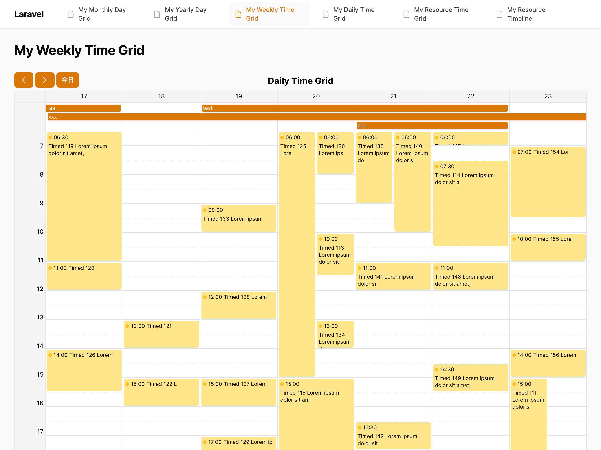

# green-calendar

## 1. Green Calendarとは

Green Calendarは、Livewireで書かれ、Filament PHPに統合性があるカレンダーコンポーネントです。

下記のようなカレンダーの種類に対応しています。
LivewireやFilamentPHPの知識だけで、ビューを細かくカスタマイズする事ができます。

- 月間カレンダー


- 年間カレンダー


- 週間カレンダー


- 日別カレンダー


- リソースカレンダー


- タイムライン


## 2. インストール

```bash
composer require kobesoft/green-calendar
```

## 3. 使い方

### 3.1. 月間カレンダーの表示

基本的なサンプルを示します。
ページに組み込むためには、`HasCalendar`トレイトを使って、`calendar`メソッドを実装します。
`form`メソッドを実装する事で、予定の登録・編集フォームを表示する事ができます。

```php:app/Filament/Pages/MyMonthlyDayGrid.php
<?php

namespace App\Filament\Pages;

use App\Models\Event;
use Carbon\CarbonPeriod;
use Filament\Forms\Components\Checkbox;
use Filament\Forms\Components\DateTimePicker;
use Filament\Forms\Components\TextInput;
use Filament\Forms\Form;
use Filament\Pages\Page;
use Kobesoft\GreenCalendar\Calendar;
use Kobesoft\GreenCalendar\Contracts\HasCalendar;
use Kobesoft\GreenCalendar\Concerns\InteractsWithCalendar;
use Kobesoft\GreenCalendar\ViewModel\EventType;

class MyMonthlyDayGrid extends Page implements HasCalendar
{
    use InteractsWithCalendar;

    protected static ?string $model = Event::class;
    protected static ?string $navigationIcon = 'heroicon-o-document-text';
    protected static string $view = 'filament.pages.my-monthly-day-grid';

    public function calendar(Calendar $calendar): Calendar
    {
        return $calendar
            ->query(function (?CarbonPeriod $period) {
                return Event::query();
            })
            ->recordTypeUsing(function (Event $event) {
                return $event->is_all_day ? EventType::AllDayEvent : EventType::TimedEvent;
            });
    }

    public function form(Form $form): Form
    {
        return $form
            ->schema([
                TextInput::make('title')
                    ->label('Title')
                    ->required(),
                DateTimePicker::make('start')
                    ->label('start')
                    ->required(),
                DateTimePicker::make('end')
                    ->label('end')
                    ->required(),
                Checkbox::make('is_all_day')
                    ->label('is_all_day'),
            ]);
    }
}
```

```php:resources/views/filament/pages/my-monthly-day-grid.blade.php
<x-filament-panels::page>
    {{$this->calendar}}
</x-filament-panels::page>
```

## 3.2. カレンダーで表示する予定データの設定

カレンダーの予定データの項目の設定は、`calendar`メソッドで行います。

### 3.2.1. 予定クエリの設定
予定データを取得するためのクエリを設定します。
$periodには、カレンダーの表示期間が渡されます。

```php
$calendar->query(function (?CarbonPeriod $period) {
    return Event::query();
})
```

### 3.2.2. 予定の種類の設定

予定の種類を設定します。
予定は`EventType`クラスを使って、`AllDayEvent`、`TimedEvent`のいずれかに分類されます。
`AllDayEvent`は終日の予定、`TimedEvent`は時間指定の予定です。

```php
$calendar->recordTypeUsing(function (Event $event) {
    return $event->is_all_day ? EventType::AllDayEvent : EventType::TimedEvent;
});
```

### 3.2.3. 予定の開始時間・終了時間の項目設定

予定の開始時間・終了時間の項目を設定します。
`start`、`end`の項目が、レコードのカラムとして存在している場合には、カラム名を渡す事で設定できます。

```php
$calendar->recordStartAttribute('start');
$calendar->recordEndAttribute('end');
```

予定のデータが例えば`start`と長さ`duration` などで構成される場合には、下記のようにします。
なお、予定の長さ変更の処理が標準のActionではできませんので、自分で実装をする必要があります。

```php
$calendar->recordStartAttribute('start');
$calendar->recordEndUsing(function (Event $event) {
    return $event->start->copy()->addMinutes($event->duration);
});
```

### 3.2.4. 予定に表示する項目の設定

予定に表示する項目を設定します。コンポーネントを登録する事で柔軟に予定の表示内容を変更できます。
FilamentPHPライクなコンポーネント指向で、カレンダー内の予定の表示内容を設定できます。

```php
$calendar->entries([
    ColorEntry::make('color')
        ->visible(fn(bool $isTimedEvent) => $isTimedEvent),
    TextEntry::make($component->getRecordStartAttribute() ?? 'start')
        ->time()
        ->visible(fn(bool $isTimedEvent) => $isTimedEvent),
    TextEntry::make('title'),
]);
```

### 3.2.5. カレンダーの日付を選択した時の処理

標準だと、カレンダー内の日付を選択する事で、\Kobesoft\GreenCalendar\Actions\CreateActionが呼び出され、
予定の作成をする事ができます。 カスタマイズすることもできます。

```php
$calendar->dateAction(
    CreateAction::make()
        ->action(arraya $arguments) {
            //:作成以外の実装など
            //$argumentsには、start、end、resourceIdが渡されます。
        }
    );
```

### 3.2.6. カレンダーの予定をクリックした時の処理

標準だと、カレンダー内の予定をクリックする事で、\Kobesoft\GreenCalendar\Actions\EditActionが呼び出され、
予定の編集をする事ができます。 カスタマイズすることもできます。

```php
$calendar->eventAction(
    EditAction::make()
        ->action(arraya $arguments) {
            //:編集以外の実装など
            //$argumentsには、keyが渡されます。
        }
    );
```

### 3.2.7. カレンダーの予定をドラッグした時の処理

標準だと、カレンダー内の予定をドラッグする事で、\Kobesoft\GreenCalendar\Actions\MoveActionが呼び出され、
予定の移動をする事ができます。 カスタマイズすることもできます。リサイズ時の処理も同様です。

```php
$calendar->eventAction(
    MoveAction::make()
        ->action(arraya $arguments) {
            //:移動以外の実装など
            //$argumentsには、key、start、end、resourceIdが渡されます。
        }
    );
```

### 3.2.8. カレンダーの予定の色を設定

予定の色を設定します。色の情報としては、FilamentPHPの色設定が使えます。


```php
use Filament\Support\Colors\Color;
$calendar->color(function (Event $event) {
    return Color::Indigo;
});
```

### 3.2.9. 表示するカレンダーの設定

表示するカレンダーの設定を行います。カレンダーの種類によって、表示するカレンダーを変更する事ができます。

```php
// 月次カレンダー
$calendar->monthlyDayGrid();
// 年間カレンダー
$calendar->yearlyDayGrid();
// 週間カレンダー
$calendar->weeklyTimeGrid();
// 日別カレンダー
$calendar->dailyTimeGrid();
// リソースカレンダー
$calendar->resourceTimeGrid();
// タイムライン
$calendar->resourceTimeline();
```

### 3.2.10. カレンダーの表示期間の設定

カレンダーの表示期間を設定します。各カレンダー毎にデフォルト値が異なります。

```php
$calendar->period(CarbonPeriod::between('2024-03-01', '2024-03-31'))
```

### 3.2.11. リソースの設定

リソースカレンダー、タイムラインの場合には、リソースの設定を行います。
予定には、リソースIDを持たせる事ができます。

```php
$calendar
    ->resources(function () {
        return Resource::query()->get();
    })
    ->recordResourceAttribute('resource_id');
```

### 3.2.12. リソースの項目設定

リソースの項目を設定します。リソースカレンダー、タイムラインの場合には、リソースの表示内容を設定します。

```php
// resourcesメソッドで取得したリソースのIDを設定します。
$calendar->resourceIdAttribute('id');
// リソースの表示名を設定します。
$calendar->resourceTitleAttribute('name');
```

### 3.2.13. ヘッダー部のカスタマイズ

カレンダーのヘッダー部の操作内容をカスタマイズします。
$calendar->headerActionsの第一引数には、操作内容を配列で渡します。
第二引数には、操作内容の配置を指定します。

```php
$calendar->headerActions([
    CreateAction::make(),
], \Filament\Support\Enums\Alignment::right);
```

### 3.2.14. ヘッダー部の見出しのカスタマイズ

カレンダーのヘッダー部の見出しをカスタマイズします。

```php
$calendar->heading('My Calendar');
```

### 3.2.15. 時間や日にちのフォーマットのカスタマイズ

カレンダーの時間や日にちのフォーマットをカスタマイズします。
Carbon形式のフォーマットを指定するか、クロージャーを指定する事ができます。

```php
$calendar->formatTimeUsing('H:mm');
$calendar->formatDateUsing('Y年M月D日');
$calendar->formatShortDateUsing('D');
$calendar->formatMonthUsing('Y年M月');
$calendar->formatShortMonthUsing('M月');
$calendar->formatYearUsing('Y年');
```

### 3.2.16. カレンダーの操作内容のカスタマイズ

カレンダーの操作内容をカスタマイズします。
標準では、日付のクリック、日付の複数選択、予定のクリック、予定のドラッグ、予定のリサイズが設定されています。
それらの操作を無効化する事ができます。

```php
// 日付のクリックを無効化
$calendar->selectable(false, multiple: false)

// 日付は単一選択のみ
$calendar->selectable(true, multiple: false)

// 予定のクリックを無効化
$calendar->clickable(false)

// 予定のドラッグを無効化
$calendar->movable(true)

// 予定のリサイズを無効化
$calendar->resizable(true)
```

### 3.3. カレンダーの表示項目のコンポーネント

### 3.3.1. カレンダーの表示項目には、Entryクラスを使って、下記のような項目を設定できます。

- TextEntry: テキストを表示する
- ColorEntry: 丸と色を表示する
- IconEntry: アイコンを表示する

### 3.3.2. TextEntry

```php
$calendar->entries([
    // 開始予定時間を表示する
    TextEntry::make('start')
        ->time(),
    // 終了予定時間を表示する
    TextEntry::make('end')
        ->time(),
]);
```

### 3.3.3. ColorEntry

```php
use Filament\Support\Colors\Color;

$calendar->entries([
    // 予定の色を表示する
    ColorEntry::make('color')
        ->color(fn(Event $event) => $event->is_error ? Color::Red : Color::Indigo),
        ->visible(fn(bool $isTimedEvent) => $isTimedEvent),
]);
```

### 3.3.4. IconEntry

任意のアイコンを表示する事ができます。

```php
$calendar->entries([
    // 予定のアイコンを表示する
    IconEntry::make('icon')
        ->icon('heroicon-o-document-text')
        ->visible(fn(bool $isTimedEvent) => $isTimedEvent),
]);
```

### 3.3.5. クロージャーを使ったカスタマイズ

予定の表示項目や、カレンダーの表示内容をクロージャーを使ってカスタマイズする事ができます。

```php
$calendar->entries([
    // 予定の色を表示する
    ColorEntry::make('color')
        ->color(fn(Event $event) => $event->is_error ? Color::Red : Color::Indigo),
        ->visible(fn(bool $isTimedEvent) => $isTimedEvent),
]);
```

```php
$calendar->color(function (Event $event) {
    return $event->is_error ? Color::Red : Color::Indigo;
});
```

予定に対する設定を行うクロージャーは、下記の引数名を解決できます。

- $livewire: イベントのレコード
- $record: イベントのレコード
- $isTimedEvent: イベントの種類が時間指定の場合にはtrue
- $isAllDayEvent: イベントの種類が終日の場合にはtrue
- $start: イベントの開始時間
- $end: イベントの終了時間
- $type: イベントの種類
- $resourceId: リソースカレンダー、タイムラインの場合にはリソースのID
- $event: ViewModel/Eventクラスのインスタンス

## 4. 利用について

Green Calendarは、オープンソースで提供しておりますが、個別にライセンス供与しています。
詳しくは、info@kobesoft.co.jp にお問い合わせください。
